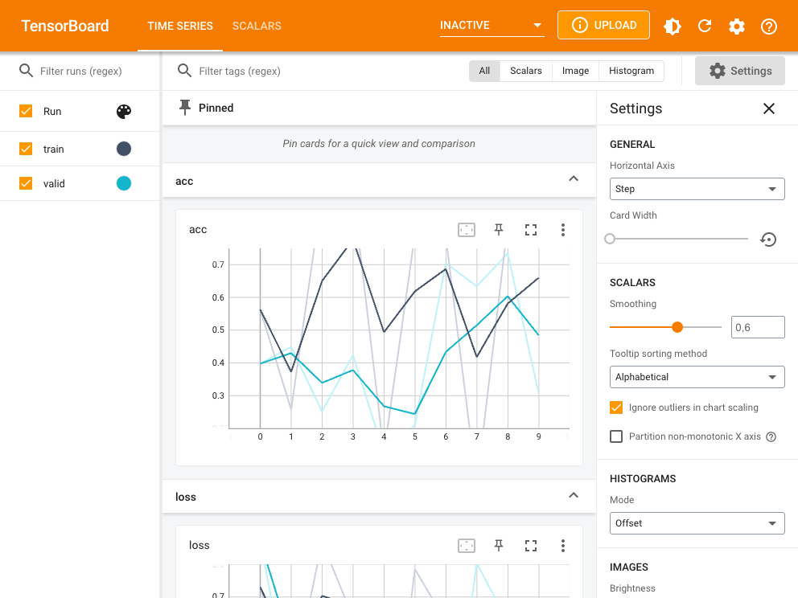

<!-- README.md is generated from README.Rmd. Please edit that file -->

# tfevents

<!-- badges: start -->

[](https://github.com/mlverse/tfevents/actions/workflows/check.yaml)
[](https://app.codecov.io/gh/mlverse/tfevents?branch=main)
<!-- badges: end -->

tfevents allows logging data from machine learning experiments to a file
format that can be later consumed by
[TensorBoard](https://www.tensorflow.org/tensorboard) in order to
generate visualizations.

## Installation

You can install tfevents from CRAN with:

``` r
install.packages("tfevents")
```

You can install the development version of tfevents from
[GitHub](https://github.com/) with:

You need to have `cmake` on your path. See installation instructions in
the [cmake install webpage](https://cmake.org/resources/) - or:

If you use `brew` on MacOS you can run:

``` shell
brew install cmake
```

Or on linux install the `cmake` library, for example on Debian systems:

``` shell
sudo apt install cmake
```

``` r
# install.packages("devtools")
devtools::install_github("mlverse/tfevents")
```

## Example

The main entrypoint in tfevents API is the `log_event` function. It can
be used to log **summaries** like scalars, images, audio (Coming soon),
histograms (Coming soon) and arbitrary tensors (soon) to a log
directory, which we like to call `logdir`. You can later point
TensorBoard to this `logdir` to visualize the results.

``` r
library(tfevents)
```

Summaries are always associated to a step in the TensorBoard API, and
`log_event` automatically increases the **`step`** everytime it’s
called, unless you provide the `step` argument.

Let’s start by logging some metrics:

``` r
epochs <- 10
for (i in seq_len(epochs)) {
  # training code would go here
  log_event(
    train = list(loss = runif(1), acc = runif(1)),
    valid = list(loss = runif(1), acc = runif(1))
  )
}
```

By default this will create a `logs` directory in your working directory
and write metrics to it - you can change the default `logdir` using
context like `with_logdir` or globally with `set_default_logdir()`.

Since we passed a nested list of metrics, `log_event` will create
subdirectories under `logs` to write metrics for each group.

``` r
fs::dir_tree("logs")
#> logs
#> ├── train
#> │   └── events.out.tfevents.1715003319.v2
#> └── valid
#>     └── events.out.tfevents.1715003319.v2
```

You can later point TensorBoard to that logdir using TensorBoard’s
command line interface or tensorflow’s utility function `tensorboard()`

``` r
tensorflow::tensorboard(normalizePath("logs"), port = 6060)
#> Started TensorBoard at http://127.0.0.1:6060
```

TensorBoard will display the results in a dashbboard, similar to one you
can see in the screenshot below:



You can learn more in the [tfevents website](#TODO).
