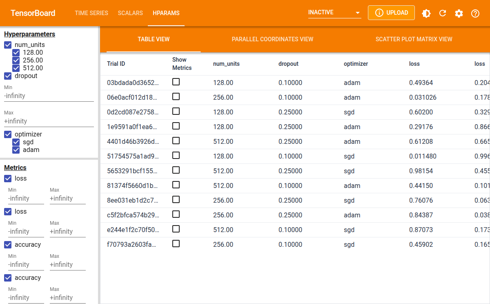

# Hyperparameter tuning

``` r
library(tfevents)
```

Hyperparameter tuning is a important step in machine learning problems.
`tfevents` has the ability to log hyperparameter values and
configurations so they can be visualized with TensorBoard.

In this tutorial we show the recommended steps to correctly log
hyperparameter runing data and visualize it in TensorBoard. We will
abstract away the model we are training and the approach described here
can work with any machine learning framework.

## Configuring the experiment

The first step to use `tfevents` to log hyperparameter tuning
experiments is to log a hyperparameter configuration using the
[`log_hparams_config()`](https://mlverse.github.io/tfevents/reference/log_hparams_config.md)
function.

In order to do it, we need to first define the set of hyperparameters
that we are going to experiment with along with their domains. We also
define the set of metrics that we want to be displayed in the HParams
dashboard.

Suppose that we want to tune a neural network that has the following
hyperparameters: `num_units`, `dropout` and `optimizer`. And that we
want to observe the training and validation loss as well as the
accuracy.

``` r
hparams <- list(
  hparams_hparam("num_units", domain = c(128, 256, 512)),
  hparams_hparam("dropout", domain = c(min_value = 0.1, max_value = 0.4)),
  hparams_hparam("optimizer", domain = c("sgd", "adam"))
)

metrics <- list(
  hparams_metric("loss", group = "train"),
  hparams_metric("loss", group = "valid"),
  hparams_metric("accuracy", group = "train"),
  hparams_metric("accuracy", group = "valid")
)
```

We can now choose a logdir and log the hyperparameter configurations:

``` r
temp <- tempfile("logdir")
local_logdir(temp)
log_hparams_config(hparams, metrics)
```

We have now logged the experiment configuration, we can now proceed to
loging runs of this experiment.

## Logging runs

We are not actually going to train any model in this tutorial, but we
will define a function that does log some metrics, like if it was
training something. This function takes the hyperparameter values, and
they should be used to configure how training happens.

``` r
train <- function(num_units, dropout, optimizer) {
  # each run will have its own logdir.
  # this modifies the logdir during the execution of this function
  epochs <- 10
  for (i in seq_len(epochs)) {
    # training code would go here
    log_event(
      train = list(loss = runif(1), accuracy = runif(1)),
      valid = list(loss = runif(1), accuracy = runif(1)),
    )
  }
}
```

We now writer a wraper function that takes the hyperparameter values
and:

1.  Creates a random logdir name for the run
2.  Temporarily modifies the default logdir, so scalars and etc for each
    run are separated in the file system.
3.  Log the set of hyperparameters that is going to be used.
4.  Runs the `train` function that we defined earlier.

``` r
run_train <- function(root_logdir, num_units, dropout, optimizer) {
  # create a random logdir name for the run. It should be a child directory
  # of root_logdir
  logdir <- file.path(
    root_logdir,
    paste(sample(letters, size = 15, replace = TRUE), collapse = "")
  )
  
  # modifies the logdir during the execution of run_train
  local_logdir(logdir) 
  
  # before running the actual training we log the set of hyperparameters
  # that are used.
  log_hparams(
    num_units = num_units,
    dropout = dropout,
    optimizer = optimizer
  )
  
  train(num_units, dropout, optimizer)
}
```

We can now use `run_train` to run training for multiple sets of
hyperparameters.

``` r
for (num_units in c(128, 256, 512)) {
  for (dropout in c(0.1, 0.25)) {
    for (optimizer in c("adam", "sgd")) {
      run_train(temp, num_units, dropout, optimizer)
    }
  }
}
```

You can see that the root logdir that we are using as `temp` will be
filled with event files.

``` r
fs::dir_tree(temp)
#> /tmp/RtmpjjsvZh/logdir26bd4bbfcb76
#> ├── bzjrestnbuefsqx
#> │   ├── events.out.tfevents.1777314647.v2
#> │   ├── train
#> │   │   └── events.out.tfevents.1777314647.v2
#> │   └── valid
#> │       └── events.out.tfevents.1777314647.v2
#> ├── events.out.tfevents.1777314646.v2
#> ├── faamrewkadgwxbh
#> │   ├── events.out.tfevents.1777314646.v2
#> │   ├── train
#> │   │   └── events.out.tfevents.1777314646.v2
#> │   └── valid
#> │       └── events.out.tfevents.1777314646.v2
#> ├── fmzbbiaqaayrcpi
#> │   ├── events.out.tfevents.1777314647.v2
#> │   ├── train
#> │   │   └── events.out.tfevents.1777314647.v2
#> │   └── valid
#> │       └── events.out.tfevents.1777314647.v2
#> ├── gkjhvqltorlvuzj
#> │   ├── events.out.tfevents.1777314646.v2
#> │   ├── train
#> │   │   └── events.out.tfevents.1777314646.v2
#> │   └── valid
#> │       └── events.out.tfevents.1777314646.v2
#> ├── ipjjkurjxbtellw
#> │   ├── events.out.tfevents.1777314647.v2
#> │   ├── train
#> │   │   └── events.out.tfevents.1777314647.v2
#> │   └── valid
#> │       └── events.out.tfevents.1777314647.v2
#> ├── mnwerlwzlgjzrdp
#> │   ├── events.out.tfevents.1777314647.v2
#> │   ├── train
#> │   │   └── events.out.tfevents.1777314647.v2
#> │   └── valid
#> │       └── events.out.tfevents.1777314647.v2
#> ├── mwlefoodfieexom
#> │   ├── events.out.tfevents.1777314646.v2
#> │   ├── train
#> │   │   └── events.out.tfevents.1777314646.v2
#> │   └── valid
#> │       └── events.out.tfevents.1777314646.v2
#> ├── qeoelfyoqaitrxp
#> │   ├── events.out.tfevents.1777314647.v2
#> │   ├── train
#> │   │   └── events.out.tfevents.1777314647.v2
#> │   └── valid
#> │       └── events.out.tfevents.1777314647.v2
#> ├── sijyaxpvjfhcepy
#> │   ├── events.out.tfevents.1777314647.v2
#> │   ├── train
#> │   │   └── events.out.tfevents.1777314647.v2
#> │   └── valid
#> │       └── events.out.tfevents.1777314647.v2
#> ├── snayorehalspkzc
#> │   ├── events.out.tfevents.1777314646.v2
#> │   ├── train
#> │   │   └── events.out.tfevents.1777314646.v2
#> │   └── valid
#> │       └── events.out.tfevents.1777314646.v2
#> ├── weytkovhgshlcph
#> │   ├── events.out.tfevents.1777314647.v2
#> │   ├── train
#> │   │   └── events.out.tfevents.1777314647.v2
#> │   └── valid
#> │       └── events.out.tfevents.1777314647.v2
#> └── yiqlnrsjmqnmkje
#>     ├── events.out.tfevents.1777314647.v2
#>     ├── train
#>     │   └── events.out.tfevents.1777314647.v2
#>     └── valid
#>         └── events.out.tfevents.1777314647.v2
```

Finally, we can visualize the experiment results in TensorBoard:

``` r
tensorflow::tensorboard(temp, port = 6060)
#> Started TensorBoard at http://127.0.0.1:6060
```

The screenshot below shows the table view in the HParams dashboard in
TensorBoard.

    #> http://127.0.0.1:6060/?darkMode=false#hparams screenshot completed



TensorBoard also provides visualizing the results in a parallel
coordinates plot and as a scatter plot.
