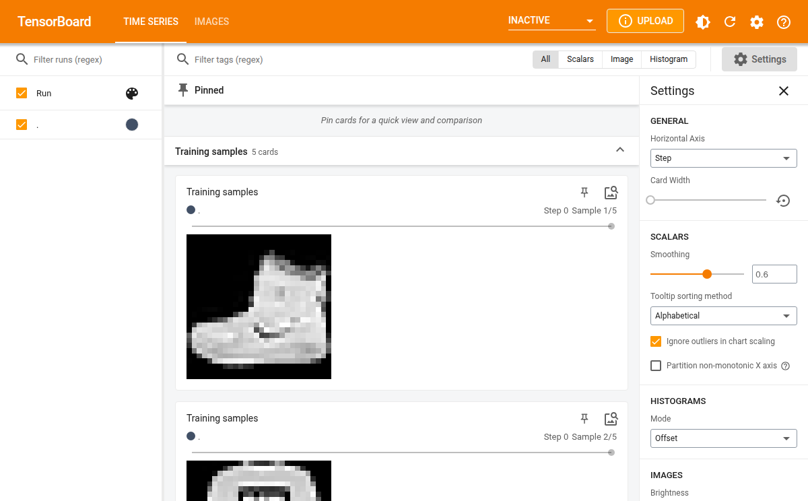
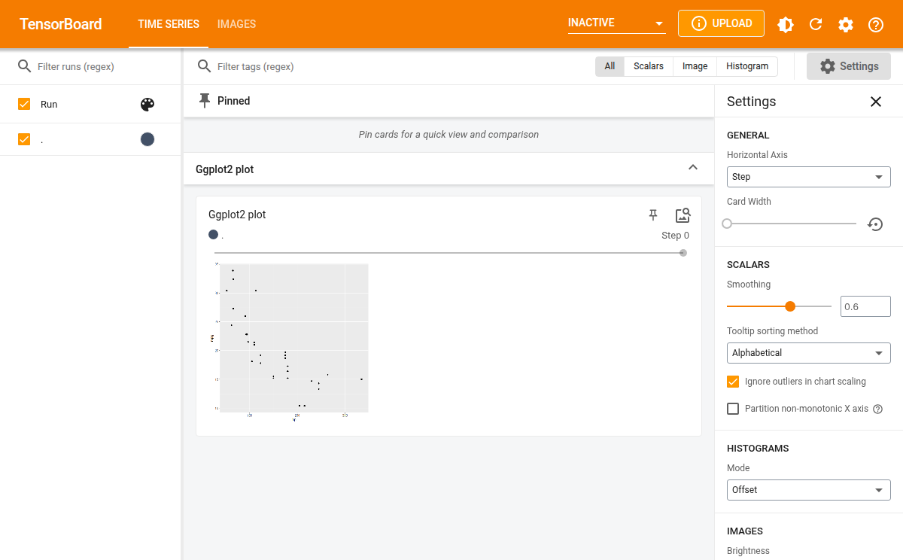
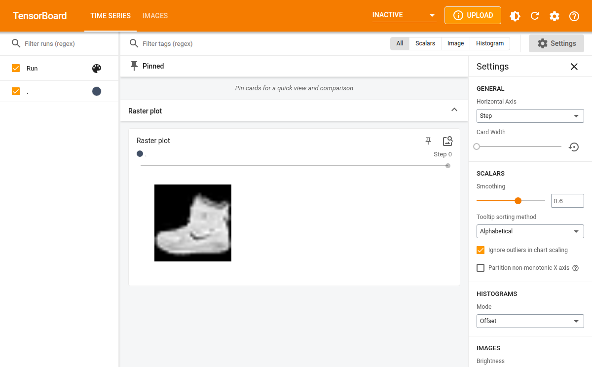

# Writing images

``` r
library(tfevents)
```

tfevents has the ability to write log images so they can be displayed in
the TensorBoard dashboard. This guide describes different ways you can
log images with tfevents and how to extend this functionality to other
kinds of R objects that you might want to log as images in the
dashboard.

## From arrays

The most common way to write images is when you have a batch of image
data in an R array. For example, suppose we want to write the first 5
training samples available in the Fashion MNIST dataset builtin into
Keras.

``` r
fashion_mnist <- keras::dataset_fashion_mnist()
#> Downloading data from https://storage.googleapis.com/tensorflow/tf-keras-datasets/train-labels-idx1-ubyte.gz
#>  8192/29515 [=======>......................] - ETA: 0s29515/29515 [==============================] - 0s 0us/step
#> Downloading data from https://storage.googleapis.com/tensorflow/tf-keras-datasets/train-images-idx3-ubyte.gz
#>     8192/26421880 [..............................] - ETA: 0s  811008/26421880 [..............................] - ETA: 1s 8044544/26421880 [========>.....................] - ETA: 0s14983168/26421880 [================>.............] - ETA: 0s21995520/26421880 [=======================>......] - ETA: 0s26421880/26421880 [==============================] - 0s 0us/step
#> Downloading data from https://storage.googleapis.com/tensorflow/tf-keras-datasets/t10k-labels-idx1-ubyte.gz
#> 5148/5148 [==============================] - 0s 0us/step
#> Downloading data from https://storage.googleapis.com/tensorflow/tf-keras-datasets/t10k-images-idx3-ubyte.gz
#>    8192/4422102 [..............................] - ETA: 0s 753664/4422102 [====>.........................] - ETA: 0s4422102/4422102 [==============================] - 0s 0us/step
train_imgs <- fashion_mnist$train$x[1:5,,]/255
str(train_imgs)
#>  num [1:5, 1:28, 1:28] 0 0 0 0 0 0 0 0 0 0 ...
```

tfevents supports writing a batch of images from an array as long as the
array has 4 dimensions: `batch_size`, `height`, `width` and `channels`.
Thus for the images in the Fashion MNIST dataset we need to add an extra
dimension denoting that those images have only one channel, ie. they are
grayscale images.

``` r
dim(train_imgs) <- c(dim(train_imgs), 1)
```

We can now log them to the default log directory (`logs`) with:

``` r
log_event("Training samples" = summary_image(train_imgs))
```

If we open the TensorBoard UI in the logdir we will see something like
the below:

``` r
tensorflow::tensorboard(normalizePath("logs"), port = 6060)
#> Started TensorBoard at http://127.0.0.1:6060
```

Notice that images are also associated to a global step counter. If you
save log images at multiple steps you will be able to visualize hwo they
change using the slider in TensorBoard.

    #> http://127.0.0.1:6060/?darkMode=false screenshot completed



## From ggplot objects

You can also write images from ggplot2 plots, for example:

``` r
library(ggplot2)
p <- ggplot(mtcars, aes(x = hp, y = mpg)) + 
  geom_point()
```

You can log plots using `log_event` and `summary_image` and they will be
displayed in TensorBoard. The default size is 480x480 pixels but you can
change the default by passing `width` and `height` to `summary_image`:

``` r
temp <- tempfile("logdir") # use another logdir 
set_default_logdir(temp)

log_event("Ggplot2 plot" = summary_image(p))
```

We now launch TensorBoard and see:

``` r
tensorflow::tensorboard(temp, port = 6061)
#> Started TensorBoard at http://127.0.0.1:6061
```

    #> http://127.0.0.1:6061/?darkMode=false screenshot completed



## Extending

Currently those are the only two builtin supported objects for writing
images with tfevents. However we provide lower level interfaces that
allow you to extend support for your own data type.

The `summary_image` function is an S3 generic, so you can implement it
for your own type. For example, we could implement support for logging a
raster image by implementing a method for it. We also provide methods
for lower level representation of images, for example,
`summary_image.raw` can write a
[`raw()`](https://rdrr.io/r/base/raw.html) vector containing a PNG
encoded image.

Let’s implement a method for writing raster images, created with
[`as.raster()`](https://rdrr.io/r/grDevices/as.raster.html). For
example, we can use the first image in the Fashion MNIST dataset that we
used earlier.

``` r
img <- as.raster(train_imgs[1,,,])
class(img)
#> [1] "raster"
```

Now let’s define the `summary_image` method for the `raster` class. We
can get a PNG encoded image by saving it to a file using
[`grDevices::png`](https://rdrr.io/r/grDevices/png.html) and then
reading it back to R.

Note that it’s important to have `metadata` and `tag` arguments in the
signature so your users can customize hwo the image is displayed in
TensorBoard.

``` r
summary_image.raster <- function(img, ..., width = 480, height = 480, metadata = NULL, tag = NA) {
  temp <- tempfile(fileext = ".png")
  on.exit({unlink(temp)}, add = TRUE)

  grDevices::png(filename = temp, width = width, height = height, ...)
  plot(img)
  dev.off()

  sze <- fs::file_info(temp)$size
  raw <- readBin(temp, n = sze, what = "raw")

  summary_image(
    raw,
    width = width,
    height = height,
    colorspace = 4, # number of channels in the IMG. since PNG - 4
    metadata = metadata,
    tag = tag
  )
}
```

We can now save the raster image with:

``` r
temp <- tempfile("logdir") # use another logdir 
set_default_logdir(temp)

log_event("Raster plot" = summary_image(img))
```

It will be displayed in the dashboard:

    #> Started TensorBoard at http://127.0.0.1:6062
    #> http://127.0.0.1:6062/?darkMode=false screenshot completed


