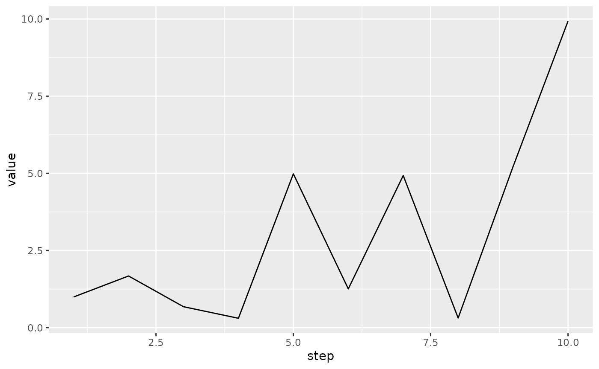

# Reading event records

``` r
library(tfevents)
```

tfevents stores events in files inside a **logdir**, there might be many
files tfevents records files in the log directory and each file can
contain many events.

tfevents provides functionality to read records writen to the log
directory and to extract their value in a convenient representation,
useful if you want to analyse the results from R.

Let’s write a few records a temporary directory, then we’ll use tfevents
functionality to read the data into R.

``` r
temp <- tempfile()
set_default_logdir(temp)
```

``` r
log_event(text = "hello world")
for (i in 1:10) {
  log_event(hello = i* runif(1))
}
```

We can **collect** all events from the *logdir* with:

``` r
events <- collect_events(temp)
events
#> # A tibble: 12 × 4
#>         event run    step    summary
#>    <tfvnts_v> <chr> <int> <tfvnts_s>
#>  1     <./ 0> .         0           
#>  2     <./ 0> .         0        [1]
#>  3     <./ 1> .         1        [1]
#>  4     <./ 2> .         2        [1]
#>  5     <./ 3> .         3        [1]
#>  6     <./ 4> .         4        [1]
#>  7     <./ 5> .         5        [1]
#>  8     <./ 6> .         6        [1]
#>  9     <./ 7> .         7        [1]
#> 10     <./ 8> .         8        [1]
#> 11     <./ 9> .         9        [1]
#> 12     <./10> .        10        [1]
```

[`collect_events()`](https://mlverse.github.io/tfevents/reference/collect_events.md)
returns a tibble with each row repesenting an event writen to that
*logdir*. Note that the tibble has 12 rows, 1 more than the number of
our calls to `log_event`. That’s because every event record file
includes an event storing some metadata, like the time it was created
and etc. The `run` column indicates the directory within the *logdir*
that the events were collected from. Although tfevents only supports
writing summary events, tfevents record files can contain other kind of
events like log message, TensorFlow graphs and metadata information (as
we see in this file), in those cases the `summary` column will have a
`NA` value. In summary events it will contain additional information on
the summary.

You might want to collect only the summary events, like those that were
created with `log_event`, in this case you can pass the `type` argument
to `collect_events` specifying the kind of events that you want to
collect.

``` r
summaries <- collect_events(temp, type = "summary")
summaries
#> # A tibble: 11 × 6
#>         event run    step    summary tag   plugin 
#>    <tfvnts_v> <chr> <int> <tfvnts__> <chr> <chr>  
#>  1     <./ 0> .         0     <text> text  text   
#>  2     <./ 1> .         1    <hello> hello scalars
#>  3     <./ 2> .         2    <hello> hello scalars
#>  4     <./ 3> .         3    <hello> hello scalars
#>  5     <./ 4> .         4    <hello> hello scalars
#>  6     <./ 5> .         5    <hello> hello scalars
#>  7     <./ 6> .         6    <hello> hello scalars
#>  8     <./ 7> .         7    <hello> hello scalars
#>  9     <./ 8> .         8    <hello> hello scalars
#> 10     <./ 9> .         9    <hello> hello scalars
#> 11     <./10> .        10    <hello> hello scalars
```

Since the above asked for summary events, the returned data frame can
include additional information like the name of the plugin that was used
to created the summary (eg. scalars, images, audio, etc) and the tag
name for the summary. This data is already included in the objects in
the `summary` column, but is extracted as columns to make analyses
easier.

You can extract the value out of a summary using the `value` function.

``` r
value(summaries$summary[1])
#> [1] "hello world"
```

Notice that `value` extracts values of a single summary and errors if
you pass more summary values. To query all values you can pass the
`as_list = TRUE` argument. This ensures that `value` will always return
a list, making it type stable no matter the size of the summary_values
vector that you pass.

``` r
# we remove the first summary, as it's a text summary
value(summaries$summary[-1], as_list = TRUE)
#> [[1]]
#> [1] 0.08075014
#> 
#> [[2]]
#> [1] 1.668666
#> 
#> [[3]]
#> [1] 1.802283
#> 
#> [[4]]
#> [1] 0.6288338
#> 
#> [[5]]
#> [1] 0.03699721
#> 
#> [[6]]
#> [1] 2.798361
#> 
#> [[7]]
#> [1] 3.484442
#> 
#> [[8]]
#> [1] 2.318138
#> 
#> [[9]]
#> [1] 6.595938
#> 
#> [[10]]
#> [1] 7.725215
```

If you are only interested in scalar summaries, you can use
`type="scalar"` in `collect_events`:

``` r
scalars <- collect_events(temp, type = "scalar")
scalars
#> # A tibble: 10 × 7
#>         event run    step    summary tag   plugin   value
#>    <tfvnts_v> <chr> <int> <tfvnts__> <chr> <chr>    <dbl>
#>  1     <./ 1> .         1    <hello> hello scalars 0.0808
#>  2     <./ 2> .         2    <hello> hello scalars 1.67  
#>  3     <./ 3> .         3    <hello> hello scalars 1.80  
#>  4     <./ 4> .         4    <hello> hello scalars 0.629 
#>  5     <./ 5> .         5    <hello> hello scalars 0.0370
#>  6     <./ 6> .         6    <hello> hello scalars 2.80  
#>  7     <./ 7> .         7    <hello> hello scalars 3.48  
#>  8     <./ 8> .         8    <hello> hello scalars 2.32  
#>  9     <./ 9> .         9    <hello> hello scalars 6.60  
#> 10     <./10> .        10    <hello> hello scalars 7.73
```

Now, values can be expanded in the data frame and you get a ready to use
data frame, for example:

``` r
library(ggplot2)
ggplot(scalars, aes(x = step, y = value)) +
  geom_line()
```



## Iterating over a logdir

Passing a directory path to `collect_events` by default collects all
events in that directory, but you might not want to collect them all at
once because of memory constraints or even because they are not yet
written, in this case you can use `events_logdir` to create an object,
similar to a file connection that will allow you to load events in
smaller batches.

``` r
con <- events_logdir(temp)
collect_events(con, n = 1, type = "scalar")
#> # A tibble: 1 × 7
#>        event run    step    summary tag   plugin   value
#>   <tfvnts_v> <chr> <int> <tfvnts__> <chr> <chr>    <dbl>
#> 1      <./1> .         1    <hello> hello scalars 0.0808
```

Notice that the first call to `collect_events` collected the first
scalar summary event in the directory because of `n = 1`. The next call
will collect the remaining ones as by default `n = NULL`.

``` r
collect_events(con, type = "scalar")
#> # A tibble: 9 × 7
#>        event run    step    summary tag   plugin   value
#>   <tfvnts_v> <chr> <int> <tfvnts__> <chr> <chr>    <dbl>
#> 1     <./ 2> .         2    <hello> hello scalars 1.67  
#> 2     <./ 3> .         3    <hello> hello scalars 1.80  
#> 3     <./ 4> .         4    <hello> hello scalars 0.629 
#> 4     <./ 5> .         5    <hello> hello scalars 0.0370
#> 5     <./ 6> .         6    <hello> hello scalars 2.80  
#> 6     <./ 7> .         7    <hello> hello scalars 3.48  
#> 7     <./ 8> .         8    <hello> hello scalars 2.32  
#> 8     <./ 9> .         9    <hello> hello scalars 6.60  
#> 9     <./10> .        10    <hello> hello scalars 7.73
```

We can now log some more scalars and recollect, you will see that the
events that were just written are now collected.

``` r
for (i in 1:3) {
  log_event(hello = i* runif(1))
}
collect_events(con, type = "scalar")
#> # A tibble: 3 × 7
#>        event run    step    summary tag   plugin  value
#>   <tfvnts_v> <chr> <int> <tfvnts__> <chr> <chr>   <dbl>
#> 1     <./11> .        11    <hello> hello scalars 0.875
#> 2     <./12> .        12    <hello> hello scalars 0.350
#> 3     <./13> .        13    <hello> hello scalars 0.103
```

This interface allows you to efficiently read tfevents records without
having them all on RAM at once, or work in a streaming way in a sense
that a process might be writing tfevents (for example in a training
loop) and another one is used to display intermediate results - for
example in a Shiny app.
