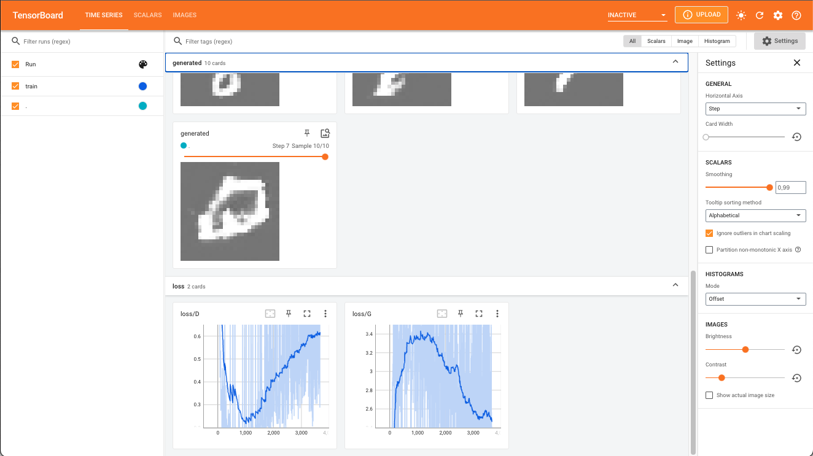

This example show how to use tfevents to log a training run of a DCGAN model.
We use tfevents to log generated images and loss values during training.

Pointing TensorBoard to the logs directory will open a dashboard like the displayed
below.



```{r, eval = FALSE}
library(torch)
library(torchvision)
library(tfevents)

# Datasets and loaders ----------------------------------------------------

dir <- "./mnist" # caching directory

train_ds <- mnist_dataset(
  dir,
  download = TRUE,
  transform = transform_to_tensor
)

test_ds <- mnist_dataset(
  dir,
  train = FALSE,
  transform = transform_to_tensor
)

train_dl <- dataloader(train_ds, batch_size = 128, shuffle = TRUE)
test_dl <- dataloader(test_ds, batch_size = 128)

# Define the network ------------------------------------------------------

init_weights <- function(m) {
  if (grepl("conv", m$.classes[[1]])) {
    nn_init_normal_(m$weight$data(), 0.0, 0.02)
  } else if (grepl("batch_norm", m$.classes[[1]])) {
    nn_init_normal_(m$weight$data(), 1.0, 0.02)
    nn_init_constant_(m$bias$data(), 0)
  }
}

generator <- nn_module(
  "generator",
  initialize = function(latent_dim, out_channels) {
    self$main <- nn_sequential(
      nn_conv_transpose2d(latent_dim, 512, kernel_size = 4,
                          stride = 1, padding = 0, bias = FALSE),
      nn_batch_norm2d(512),
      nn_relu(),
      nn_conv_transpose2d(512, 256, kernel_size = 4,
                          stride = 2, padding = 1, bias = FALSE),
      nn_batch_norm2d(256),
      nn_relu(),
      nn_conv_transpose2d(256, 128, kernel_size = 4,
                          stride = 2, padding = 1, bias = FALSE),
      nn_batch_norm2d(128),
      nn_relu(),
      nn_conv_transpose2d(128, out_channels, kernel_size = 4,
                          stride = 2, padding = 3, bias = FALSE),
      nn_tanh()
    )
    self$main$apply(init_weights) # custom weight initialization
  },
  forward = function(input) {
    input <- input$view(c(input$shape, 1, 1))
    self$main(input)
  }
)

discriminator <- nn_module(
  "discriminator",
  initialize = function(in_channels) {
    self$main <- nn_sequential(
      nn_conv2d(in_channels, 16, kernel_size = 4, stride = 2, padding = 1, bias = FALSE),
      nn_leaky_relu(0.2, inplace = TRUE),
      nn_conv2d(16, 32, kernel_size = 4, stride = 2, padding = 1, bias = FALSE),
      nn_batch_norm2d(32),
      nn_leaky_relu(0.2, inplace = TRUE),
      nn_conv2d(32, 64, kernel_size = 4, stride = 2, padding = 1, bias = FALSE),
      nn_batch_norm2d(64),
      nn_leaky_relu(0.2, inplace = TRUE),
      nn_conv2d(64, 128, kernel_size = 4, stride = 2, padding = 1, bias = FALSE),
      nn_leaky_relu(0.2, inplace = TRUE)
    )
    self$linear <- nn_linear(128, 1)
    self$main$apply(init_weights) # custom weight initialization
  },
  forward = function(input) {
    x <- self$main(input)
    x <- torch_flatten(x, start_dim = 2)
    x <- self$linear(x)
    x[,1]
  }
)

# Initialize models

latent_dim <- 100
channels <- 1

G <- generator(latent_dim = latent_dim, out_channels = channels)
D <- discriminator(in_channels = 1)

# Set up optimizers

opt_D <- optim_adam(
  D$parameters,
  lr = 2*1e-4, betas = c(0.5, 0.999)
)

opt_G <- optim_adam(
  G$parameters,
  lr = 2*1e-4, betas = c(0.5, 0.999)
)
  

bce <- nn_bce_with_logits_loss()

# Training loop ----------

fixed_noise <- torch_randn(10, latent_dim = latent_dim)

for (epoch in 1:10) {
  coro::loop(for (batch in train_dl) {
    input <- batch[[1]]
    
    batch_size <- input$shape[1]

    noise <- torch_randn(batch_size, latent_dim)
    
    fake <- G(noise)

    # create response vectors
    y_real <- torch_ones(batch_size)
    y_fake <- torch_zeros(batch_size)
    
    opt_D$zero_grad()
    loss_D <- bce(D(input), y_real) + bce(D(fake$detach()), y_fake)
    loss_D$backward()
    opt_D$step()
    
    opt_G$zero_grad()
    loss_G <- bce(D(fake), y_real)
    loss_G$backward()
    opt_G$step()
    
    log_event(
      train = list(
        "loss/D" = loss_D$item(),
        "loss/G" = loss_G$item()
      )
    )
  })
  with_no_grad({
    img <- G(fixed_noise)
    img <- as_array((img[,1,,,newaxis] + 1)/2)
    log_event(
      generated = summary_image(img),
      step = epoch
    )
  })
}
```

